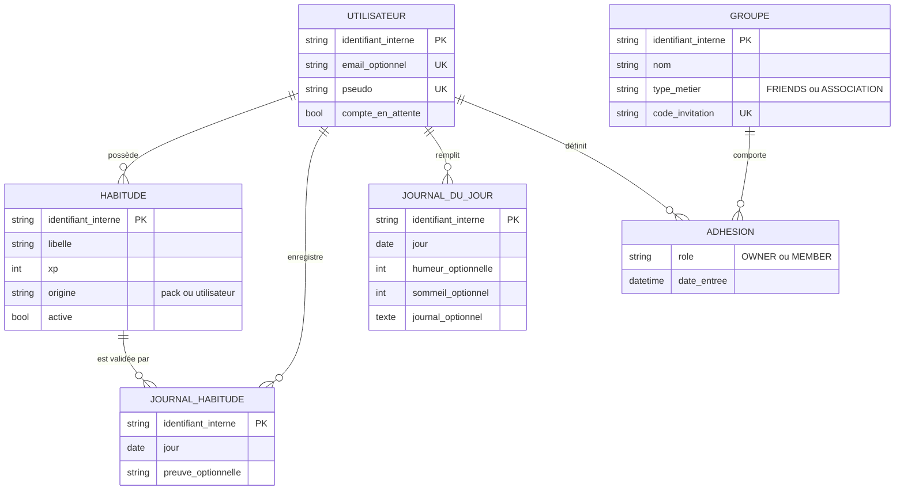

# MCD — Modèle Conceptuel de Données

**Rôle :** décrire le **métier** (quoi ? qui avec qui ?) sans parler de tables ni de SQL.  
**Indépendance :** totalement **indépendant du SGBD**.

---

## Entités principales

| Entité | Signification métier |
|--------|----------------------|
| **Utilisateur** | Compte (solo, membre asso, éducateur) |
| **Groupe** | Espace collectif (amis ou association) |
| **Habitude** | Routine suivie par un utilisateur |
| **Journal de habitude** | Validation d’une habitude à une date donnée |
| **Journal du jour** | Check-in quotidien (humeur, sommeil, journal) |

## Associations (vue métier)

- Un **Utilisateur** possède **plusieurs Habitudes** ; une **Habitude** appartient à **un** Utilisateur.
- Un **Utilisateur** enregistre **plusieurs** journaux de habitude ; chaque ligne concerne **une** Habitude à **une** date.
- Un **Utilisateur** a **au plus un** journal du jour **par date civile**.
- Un **Utilisateur** peut participer à **plusieurs Groupes** ; un **Groupe** regroupe **plusieurs** Utilisateurs — avec un **rôle** (éducateur / membre) porté par la **liaison** (adhésion).

## Diagramme MCD (Mermaid)

> Cardinalités en lecture « entité1 — association — entité2 ».

*Note : en Merise « pur », l’entité **Adhésion** correspond à la table de liaison n-aire ; ici elle matérialise la relation Utilisateur–Groupe avec attributs (rôle, date).*
