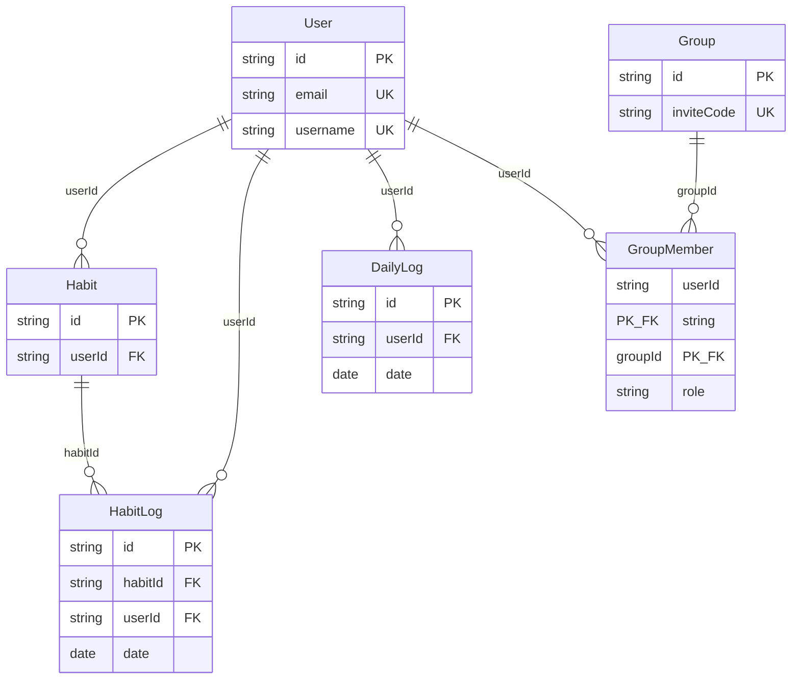

# MLD — Modèle Logique de Données

**Rôle :** traduire le MCD en **tables relationnelles** (clés primaires / étrangères, cardinalités).  
**Indépendance :** logique **relationnelle standard** ; encore **sans** détail des types physiques exacts.

---

## Tables

### `User` (Utilisateur)

| Attribut | Rôle |
|----------|------|
| `id` | PK |
| `email` | UK, nullable (invitations éducateur) |
| `username` | UK |
| `passwordHash` | nullable tant que compte non activé |
| `avatar`, `isPending`, `activationCode` | UK si présent |
| `createdAt`, `updatedAt` | audit |

### `Group` (Groupe)

| Attribut | Rôle |
|----------|------|
| `id` | PK |
| `name` | nom affiché |
| `type` | énumération `{ FRIENDS, ASSOCIATION }` |
| `inviteCode` | UK |
| `createdAt` | création |

### `GroupMember` (Adhésion Utilisateur–Groupe)

| Attribut | Rôle |
|----------|------|
| `(userId, groupId)` | **PK composite** |
| `userId` | FK → `User.id` |
| `groupId` | FK → `Group.id` |
| `role` | `{ OWNER, MEMBER }` |
| `joinedAt` | date d’entrée |

**Cardinalités :** N utilisateurs ↔ N groupes via cette table.

### `Habit` (Habitude)

| Attribut | Rôle |
|----------|------|
| `id` | PK |
| `userId` | FK → `User.id` |
| `name`, `icon`, `xp`, `order` | contenu |
| `origin` | `{ DEFAULT, USER }` |
| `isActive`, `createdAt` | cycle de vie |

### `HabitLog` (Journal de habitude)

| Attribut | Rôle |
|----------|------|
| `id` | PK |
| `habitId` | FK → `Habit.id` |
| `userId` | FK → `User.id` |
| `date` | jour civil (type *date* au MPD) |
| `proofUrl` | optionnel |

**Contrainte d’unicité :** `(habitId, date)` — une cochette par habitude et par jour.

### `DailyLog` (Journal du jour)

| Attribut | Rôle |
|----------|------|
| `id` | PK |
| `userId` | FK → `User.id` |
| `date` | jour civil |
| `mood`, `moodReason`, `sleepQuality`, `journal` | optionnels |
| `updatedAt` | dernière mise à jour |

**Contrainte d’unicité :** `(userId, date)` — une entrée check-in / sommeil / journal par utilisateur et par jour.

---

## Schéma relationnel (Mermaid)

